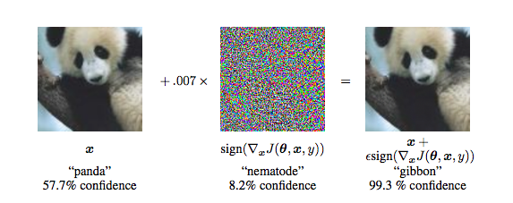

# Robust A.I.

Sometimes, deep learning can be easily fooled by using **adversarial samples.** With a very small which humans cannot sense, deep learning will result in an incorrect output. For example:

